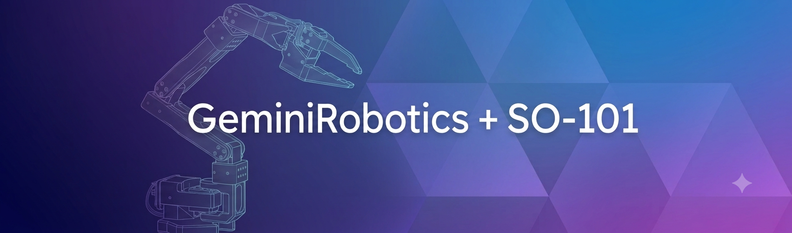
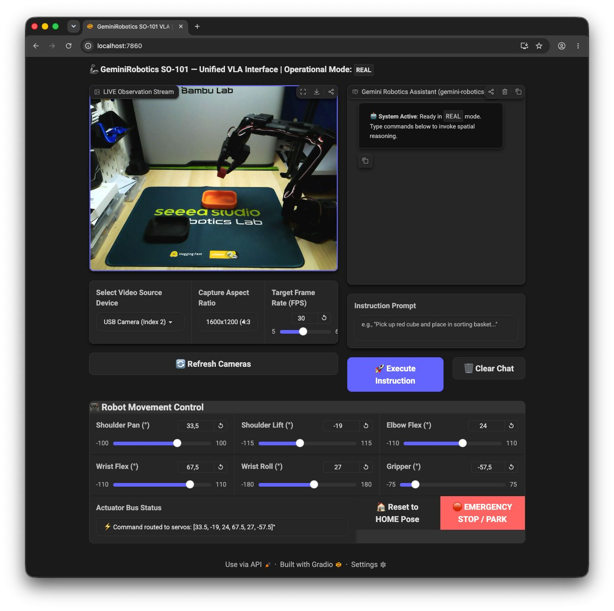

# 

## Welcome to **GeminiRobotics-SO101** 🤖

This repository combines Google's Gemini Robotics AI models (`gemini-robotics-er`) and capabilities with the **SO-101 Robotic Arm** setup.

At the core of our user experience is a state-of-the-art **Gradio 6.0 Web VLA Interface** powered by OpenCV. 

This interactive web application serves as the unified dashboard for physical hardware manipulation, real-time video observation streaming, degree-tuned actuator adjustments, and multimodal action execution!

<p align="center">
  
</p>


We use Python version **3.13.7** and the extremely fast and deterministic package manager `uv` for managing all environments and dependencies.

> [!IMPORTANT]
> This repo is actively under development as we integrate intelligent robotics behaviors and VLA trajectory inference driven by Gemini Robotics!

## Architecture & Modules

To keep code modular and hardware, simulation, and user interfaces cleanly isolated, the repository is structured into three primary packages:

1. **[`/robot`](robot/) (Core Robot Definition)**
   - **Constants & Poses**: Definitional parameters, joint names, actuator names, and standard target postures ([`constants.py`](robot/constants.py)).
   - **Kinematics & Theory**: Forward kinematics ([`kinematics.py`](robot/kinematics.py)), numerical damped least-squares Inverse Kinematics ([`cartesian_ik.py`](robot/cartesian_ik.py)), and mathematical theoretical foundations ([`theory.md`](robot/theory.md)).
   - **Hardware & Digital Twin**: Physical serial bus interfaces for Feetech servos ([`real_robot.py`](robot/real_robot.py)) and simultaneous simulation-to-hardware streaming ([`twin_robot.py`](robot/twin_robot.py)).

2. **[`/simulation`](simulation/) (MuJoCo Physics & Environments)**
   - **Physics Simulation**: High-level MuJoCo model manipulation ([`sim_robot.py`](simulation/sim_robot.py)) and passive 3D interactive rendering ([`simulate.py`](simulation/simulate.py)).
   - **Reinforcement Learning & Warp**: Gymnasium reach target environments ([`env.py`](simulation/env.py)) and hardware-accelerated batched simulations using NVIDIA Warp ([`warp_env.py`](simulation/warp_env.py)).
   - **Validation & Test Suites**: Diagnostic verifiers including linear Cartesian sweeps ([`test_movement.py`](simulation/test_movement.py)) and system health checks ([`check_env.py`](simulation/check_env.py)).

3. **[`/ui`](ui/) (Unified Gradio VLA Web UI & Vision Streaming)**
   - **Web UI & Chat Interface**: State-of-the-art dark-mode (`TehnoX`) Gradio 6.0 web application featuring interactive multimodal chat for Gemini Robotics (`gemini-robotics-er`), compact typography, real-time actuator bus feedback, and degree-converted servo control sliders with physical safety bounds ([`app.py`](ui/app.py)).
   - **Vision Streaming & Camera Enumeration**: High-throughput Motion JPEG (MJPG) streaming over OpenCV, low-latency Server-Sent Events (SSE) stream source switching, and native macOS hardware camera enumeration via AVFoundation ([`stream.py`](ui/stream.py)).

## Getting Started

### Requirements

- Python 3.13.7
- `uv` package manager ([Instructions here](https://docs.astral.sh/uv/getting-started/installation/))
- Clone this repository:

```bash
git clone https://github.com/johannstark/GeminiRobotics-SO101.git
cd GeminiRobotics-SO101
```

- Setup the repository environment and install dependencies:

```bash
uv sync
source .venv/bin/activate
```

- Use the LeRobot package to find the serial port of your physical SO-101 robotic arm and calibrate it, using [this guide](https://huggingface.co/docs/lerobot/so101).
- You are now ready to launch the Web UI and control your physical robot!

## Running the Robot (`main.py`)

The [`main.py`](main.py) script is the unified entry point for running the SO-101 robotic arm in physical control, MuJoCo simulation, digital twin mode, or automated verification. By default, running `main.py` instantly launches the modern **Gradio VLA Web UI Server** on port `7860`, connecting directly to your hardware arm in `real` mode without requiring desktop display windows!

```bash
# Instantly launch the Unified Gradio VLA Web UI server (default mode is 'real')
# Open your browser at http://localhost:7860/
uv run python main.py

# Launch Web UI specifying an explicit physical serial port
uv run python main.py --mode real --port /dev/tty.usbmodem5B415332861

# Launch Web UI with simulated arm placeholders (sim or twin modes)
uv run python main.py --mode sim
uv run python main.py --mode twin --port /dev/tty.usbmodem5B415332861
```

> [!NOTE]
> The `--port` argument defaults to `/dev/tty.usbmodem5B415332861`. If your serial adapter differs, replace it with the actual device path of your SO-101 arm. You can find your hardware port using the `lerobot-find-port` utility.

## Testing & Movement Validation

Whenever you want to test that the robot movement, inverse kinematics solver, MuJoCo physics, and robot definitions are working properly, invoke our built-in test commands:

```bash
# 1. Verify movement & kinematics via automated X, Y, and Z Cartesian line sweeps
uv run python main.py --task test_simulation

# 2. Check system diagnostics, dependency imports, and MuJoCo FPS throughput
uv run python main.py --task check_environment
```

## Kinematics & Mathematics Reference

For a complete explanation of Denavit-Hartenberg (DH) parameters, transformation matrices, spatial Jacobians, and under-actuated 5-DOF damped least-squares Inverse Kinematics, consult our documentation:

- [SO-101 Robot Arm Kinematics Theory (`robot/theory.md`)](robot/theory.md)

---

Made with ❤️ in Colombia 🇨🇴
